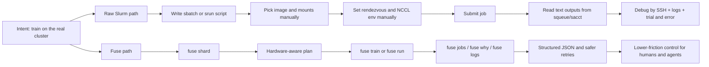
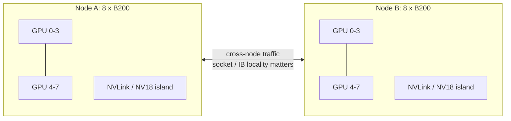
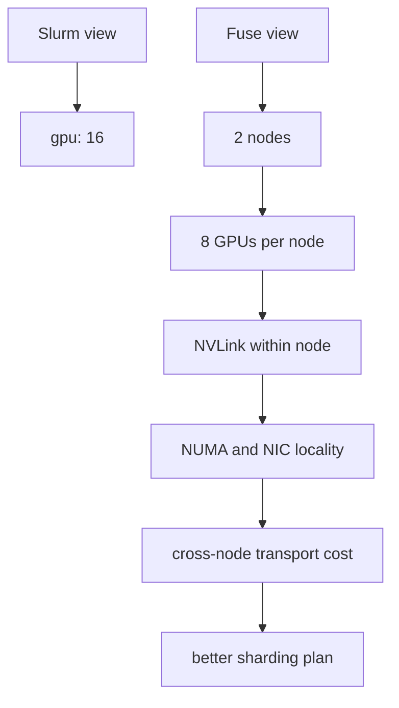
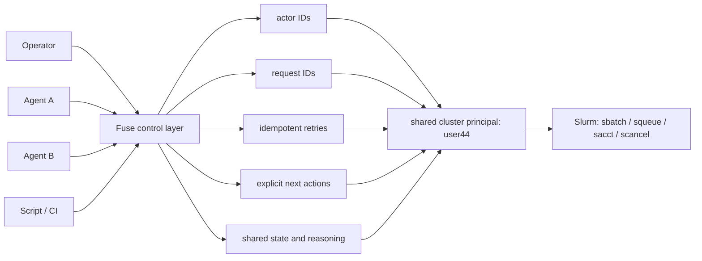
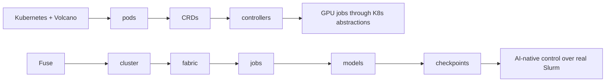
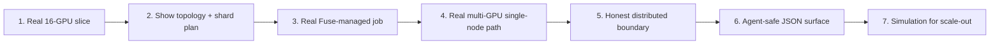

# Fuse Demo Visuals

This file contains the visual assets to support the current honest demo story.

These visuals are designed to help with three things:

1. Make the `Fuse vs Slurm` contrast obvious
2. Make the `16 GPU` cross-node topology story concrete
3. Make the `many agents, one cluster principal` wedge easy to understand

Use these in slides, the web app, or as source material for a polished deck.

## Visual 1: Same Cluster, Different Surface

Use this as the opening comparison.

What to say:

- Same cluster
- Same Slurm substrate
- Different operating surface

## Visual 2: The 16-GPU Slice

Use this when explaining why topology matters.

What to say:

- The allocation is real, not synthetic
- Cross-node is guaranteed
- Once the run crosses nodes, placement and sharding affect throughput directly

## Visual 3: Weighted Topology, Not Flat GPU Counts

Use this to sharpen the Fuse vs Slurm point.

What to say:

- Slurm gives you a count
- Fuse gives you the shape

## Visual 4: Many Agents, One Cluster Principal

Use this as the core multi-agent visual.

What to say:

- `user44` is transport, not real identity
- The wedge is not “an agent can call the CLI”
- The wedge is safe parallelism with lower collision risk

## Visual 5: Why Fuse, Not Volcano

Use this after the product story is already established.

What to say:

- Volcano is the strongest Kubernetes-native comparison
- It still lives at the Kubernetes abstraction layer
- Fuse is trying to expose AI work directly with a thinner setup path

## Visual 6: Demo Run-Of-Show

Use this as your speaker map.

What to say:

- Live proof first
- Simulation second
- Honest boundaries throughout

## Visual 7: Fuse vs Slurm Operator Experience

Use this as a table slide.

| Task | Raw Slurm | Fuse |
|---|---|---|
| Understand the slice | `scontrol`, `sinfo`, manual topology probing | `fuse status`, `fuse nodes`, `fuse fabric`, `fuse topo` |
| Plan a 16-GPU run | human guesses | `fuse shard --model llama-70b --gpus 16` |
| Submit a simple training job | batch script or `srun` | `fuse train --example makemore` |
| Explain state | text from `squeue` / `sacct` | `fuse jobs`, `fuse why` |
| Logs | hunt down output path | `fuse logs <job>` |
| Safer automation | caller-managed | `--json`, explicit reasoning, lower-collision workflows |

## Visual 8: What Is Live vs What Is Direction

Use this to stay credible with technical audiences.

| Area | Live now | Direction / next step |
|---|---|---|
| Topology discovery | Yes | richer benchmarking |
| Sharding plans | Yes | tighter calibration |
| Single-GPU Fuse train | Yes | broader examples |
| Single-node multi-GPU `nanochat` | Yes | more validated images |
| Multi-node `nanochat` through Fuse | No | current gap |
| Multi-node manual Slurm launcher | Yes | bridge to full Fuse launcher |
| JSON / `why` surface | Yes | stronger action preconditions |
| Full multi-agent lease system | No | active design direction |

## Visual Style Notes

If you hand this off to a slide tool or another model:

- Keep the look terminal-first, not corporate
- Use dark neutrals, green/cyan accents, and one warning color
- Favor lane diagrams, graph diagrams, and operator tables over generic icons
- Make the `Fuse vs Slurm` contrast feel immediate
- Make the `many agents, one cluster principal` visual feel like a systems product wedge, not an AI gimmick
